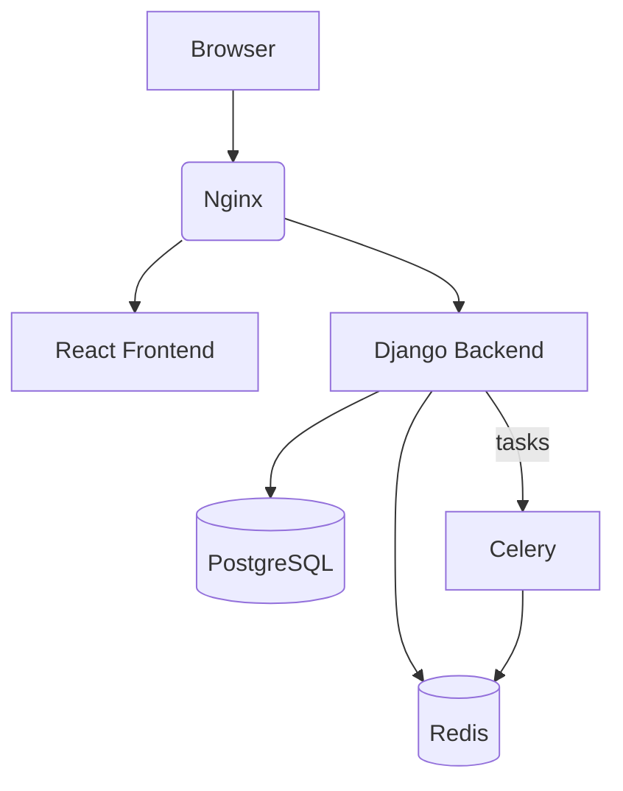

# Architecture Overview

This diagram shows how the main services communicate when running RoyaltyX with Docker.

Nginx acts as the entry point for both the frontend and backend. Celery processes background jobs such as data synchronization and payment events, storing task metadata in Redis. PostgreSQL holds application data.
